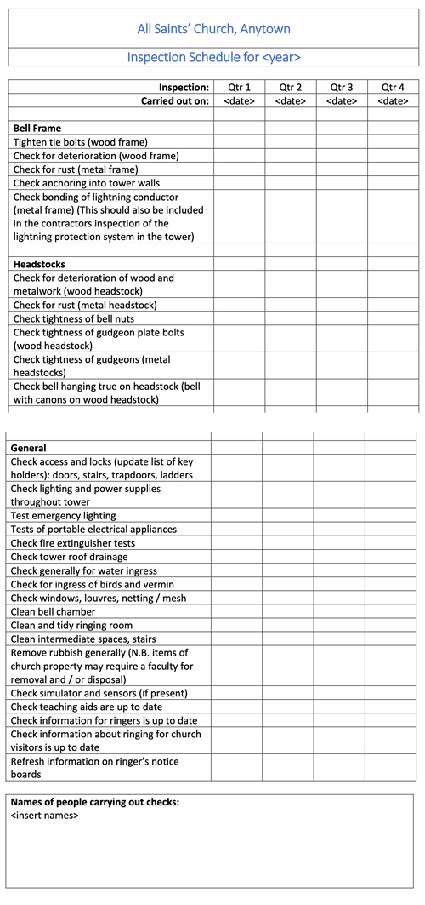
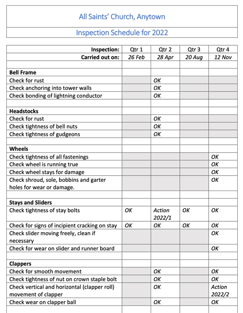
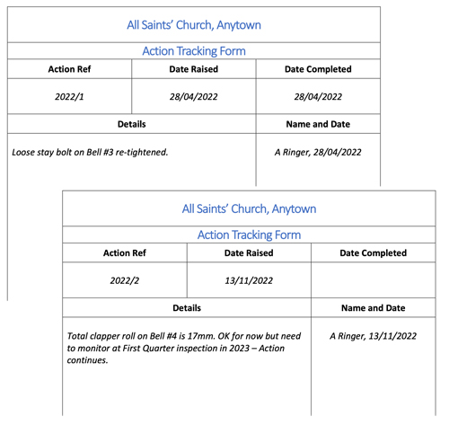

# Maintenance Schedule

The maintenance schedule is an important document: 
  - It defines what items need regular checking and how often. 
  - It includes provision for recording the results, including any remedial work carried out or still outstanding. 
  - It provides evidence that the schedule has been observed in case of any incidents.

This chapter includes a model schedule and reporting sheets for download and modification to suit the needs of your tower, and guidance on how that modification can be carried out. 


For convenience, the term “**Church**” is here used to mean the authorities responsible for the tower – the Church Wardens and PCC in the Church of England, or their equivalents in other denominations world-wide. It can also be taken to cover those responsible for non-religious buildings which include rings of bells – for example, the Town Council for a municipal ring.


## Model Schedule

A suggested model schedule – which also acts as a checklist – is available for you to download and save. This is not meant to be prescriptive. If you would prefer to produce the schedule in a different way that is fine. But we hope the information given here will be useful.

Two download formats are available:


You may need to tell your browser to accept downloads from Belfry Maintenance.

  - [Microsoft® Word (.docx)](static/schedule.docx)
  - [LibreOffice Writer (.odt)](static/schedule.odt)

The model schedule is three pages long so, to give an idea of the content, Figure 1 shows the top part of the first page and the bottom part of the third. When modified to suit your tower, this will be filled in when checks are carried out, with one sheet per year. Note that there is a space at the bottom of the last page to records the name(s) of those carrying out the checks.

*Figure 1: Screenshot of the beginning and end of the downloaded model schedule*

All towers vary, so you will now need to modify the downloaded file to suit the needs of your own tower. How you do this is up to you, but we will provide some guidance. You may also be able to obtain advice from other local towers or your local Ringing Association.

As a start, you will need to enter details of your tower. You can personalise this as you wish: change the colour, add a photograph or whatever. Note that this document is set up to repeat the first four rows at the start of each page.


Please remember that you must not become a slave to the schedule. A Steeple Keeper must always be ready for unexpected events: Did someone just bump a stay heavily? Is an experienced ringer complaining that a bell is not going as well as usual? In cases like this, a good Steeple Keeper will check as soon as possible, rather than waiting for the next scheduled inspection. You will see later that there are report sheets to cover such occasions.


There are three main factors you need to consider as you personalise the schedule further, as set out below.

### Relationship with the Church

You should share and explain your schedule with the **Church**, remembering that they may not be familiar with all aspects of a bell installation. You should make it clear that your inspections and any remedial work you need to carry out, or commission from a Bell Hanger, aims  to protect the church from a much more expensive outlay in the long run, and the possibility of damage, injury or both.

Some items in the model schedule are the responsibility of the **Church**: portable appliance tests and checks on fire extinguishers, for example. Your responsibility here is to warn the **Church** if they are overdue in the tower – it is not unknown for contractors to forget about items ‘upstairs’. Most churches are subject to a Quinquennial Inspection, usually carried out by the church architect. You should work with the **Church** to ensure that this covers the tower (not always the case) and that the Steeple Keeper is able to liaise with the inspecting architect on matters associated with the bell installation.

It is possible that the Steeple Keeper may agree with the **Church** to accept responsibility for some of ‘their’ checks – maybe the checks on lighting if the responsible Churchwarden in unable to deal with the stairs. In these cases, you must agree a reporting format, sign off checks as they are done appropriately and ensure that the results are placed in the church records.

Some areas within a tower will be shared with others: the clock winder or the person who puts up the flag, for example. In these cases, you need to be clear where your area of responsibility ends. Ground floor rings are very often shared spaces; ringers may share such space with the choir, cleaning equipment, flower arrangers,  even equipment for maintaining the churchyard, and so on.

### Content of the schedule

This is where you remove the items not applicable to your installation or add ones peculiar to your tower which are not covered in the model schedule. Note that the items in the schedule follow the same order as the chapters in *Belfry Upkeep*. The relevant chapter provides details of the checks to be carried out. In addition, your local Guild or Association may be able to provide advice.

The items under ‘General’ may be more difficult – every tower is different and liaison with the **Church** may be essential. In many cases, these will be the responsibility of the **Church** and, as noted above, the Steeple Keeper will check that they have not been missed or will carry them out by agreement with the **Church**.

### Timing of the checks

The model schedule assumes four checks, at three-monthly intervals, with one sheet per year. While this is a good starting point, it may not be suitable for your tower. Almost certainly, you will not need to check everything on the list four times each year. You should be able to identify ‘Major’ and ‘Minor’ checks. Items not needed in Minor checks can be greyed-out on that box in the schedule. Major checks are best carried out in the Spring and Autumn, to avoid extremes of climate, and other checks may need to be carried out at certain times of the year. An example of this is checks on the tightness of fixings on wooden components, which are best carried out in the Autumn, on the optimistic assumption that Summer will be dry with the possibility of wood shrinking.

If usage of the bells is light – perhaps only Sundays and practice nights – you might judge that twice-yearly checks are adequate. For the reasons given above, a minor check in the Spring and a major one in the Autumn is probably the best choice.

You should consider changing the checking frequency based on experience. Initially, to be on the safe side, you might check a component every three months. You could then consider extending the frequency to six months or longer if these checks show no change.

Depending on the installation and usage of the bells, some checks may be required more frequently than quarterly. Some examples are:
  - A monthly short functional check is a requirement for emergency lighting.
  - If you are teaching learners, with frequent bumping of stays, a monthly check for cracking may be prudent (although you should perhaps also review the way you teach leaners).
  - It may be wise to complete a check before a major event – for example, a striking competition, a peal or quarter peal marking a special occasion that you would not wish to lose as a consequence of inadequate prior checks
  - Take the opportunity to undertake checks when putting on or removing muffles, when you will necessarily be climbing around the belfry 
 

We cannot cover all eventualities so, if this is an issue for you, you will need to devise your own check sheet covering more frequent checks.

### Example of schedule

To illustrate the points above, the first part of a (fictitious) example schedule is shown in Figure 2. Comparing it with Figure 1, you will see that this tower has a metal bell frame and traditional stays and sliders. Non-relevant items have been deleted and some inspection intervals have been ‘greyed-out’ where not considered necessary. (You may argue with these but, remember, it is just an example.) It also includes some example results needing action, which will be discussed in the next section.

*Figure 2: Example Schedule, with results*

## Recording and Reporting

### Recording

Optimistically, most items on the schedule will not require action after checking, so we have suggested small boxes for reporting each item. If no action is needed, these can be completed with a tick or ‘OK’. However, some items might need attention. Examples are:
  - A minor problem that was corrected during the checking – for example, a loose nut was tightened.
  - Something was noted which will need attention – for example, a rope might be showing signs of wear and will need repair or replacement.

To deal with these, we suggest the use of ‘Action Tracking’ sheets, which are available for you to download and save. Again, two download formats are available:
  - [Microsoft® Word (.docx)](static/tracking.docx)
  - [LibreOffice Writer (.odt)](static/tracking.odt)

Figure 3 is a screenshot of this document.

*Figure 3: Screenshot of Action Tracking Sheet*

Each item needing attention should be shown by a consecutive number on the reporting sheet – in Figure 2 we suggest the year followed by a number. This is then used as the ‘Action Reference’ on the tracking sheet. The action sheet will also show the dates that the action was raised and when completed. To cover all possibilities the remainder of the tracking sheet is blank but the entry should indicate:
  - The urgency of the work:
  - Was it carried out during the check?
  - Does it indicate a progressive problem which needs monitoring? 
  - Is it serious enough to present a risk to personnel or the installation? In which case, immediate action will be required.
  - Whether the work can be carried out by local effort or if assistance is needed, either from the local Guild or Association or from a bell hanger.

The ‘Details’ column records the action(s) taken, with dates and the name(s) of those involved in the right hand column. Note that the lists of actions needed may extend over some time. The table is designed to expand, if necessary, over more than one page.


If a problem arises outside the normal checking schedule, a tracking sheet should be used to record it and the actions taken.


### Example of action tracking

To illustrate the use of the Action Tracking form, Figure 4 shows two example forms filled in with the actions from the example schedule in Figure 2. 

*Figure 4: Examples of completed Action Tracking forms*

You will see that Action 1 is a case where a lose stay bolt has immediately been rectified. Action 2 is a case where possibly increased clapper bush wear has been noted; immediate action has not been felt necessary but the situation needs to be checked at the next inspection, when the same tracking form will be updated.

### Reporting

We cannot be dogmatic here about who should see the reports of checks and any resulting actions. This depends on the relationship between the ringers and the **Church**. Some points to consider are:
  - The easy way would be simply to copy reports to all personnel connected with the **Church**. That is also the easiest way to ensure that nobody will read them.
  - A better way is to identify an individual within the **Church** who takes an interest and accepts the responsibility of maintaining contact with the ringers – in the Church of England, this might be one of the Churchwardens.
  - Another way is for one of the ringers to be a member of the local **Church** organisation – the Parochial Church Council maybe.
  - A further way is for the Steeple Keeper to present an annual report to the **Church**, preferably in person. Any major incidents would, of course, be reported at the time they occur.
  - Whatever option is adopted, the records must be stored, electronically or on paper, in a form that can be recovered if the Steeple Keeper changes or is not available.

----


**[Next Chapter](../160-fault-finding/)** - **[Previous Chapter](../130-bells/)**


-----

## Disclaimer
 
*Whilst every effort has been made to ensure the accuracy of this information, neither contributors nor the Central Council of Church Bell Ringers can accept responsibility for any inaccuracies or for any activities undertaken based on the information provided.*

Version 2.0, November 2022

© 2022 Central Council of Church Bell Ringers

